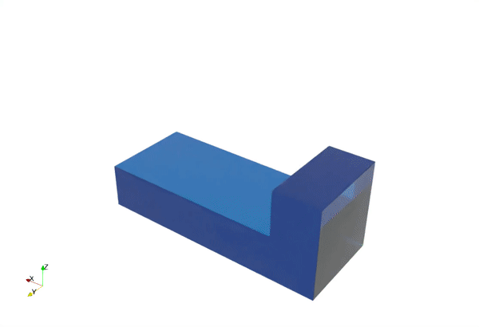

# Visualization: MPM 🎨

This repo can be used to do surface reconstruction for the results from MPM simulation. Currently,
It is using [splashsurf](https://github.com/InteractiveComputerGraphics/splashsurf)[^1] to generate surfaces, and render the surfaces in [ParaView](https://www.paraview.org/download/). 

> [!WARNING]
> This is just an experimental attempt, and there is no guarantee of the correctness of the results. There are no fixed parameters for all simulations, so it requires experience and careful adjustment of parameters according to each individual's standards. Note that **splashsurf** is used for SPH originally.

## 1. Generate surfaces

```julia
#-------------------#
# Main: user inputs |
#-------------------#

hdf_path    = joinpath(@__DIR__, "")
ply_path    = joinpath(@__DIR__, "ply_set")
splash_path = joinpath(@__DIR__, "splash_set")
generate_ply(hdf_path, ply_path, splash_path, 0.020, 20)
```

We need to fill this part in `main.jl`, where `hdf_path` is the path of `HDF5` file generated from `MPMSolver.jl`. 

The parameters for the function `generate_ply()` can be modified by user.

```julia
generate_ply(hdf_path   ::String, 
             ply_path   ::String, 
             splash_path::String, 
             radius,
             num_threads;
             cube_size=0.6,
             surface_threshold=0.6, 
             smoothing_length=1.2)
```

The meaning of these parameters can be found from [here](https://github.com/InteractiveComputerGraphics/splashsurf?tab=readme-ov-file#all-command-line-options).

## 2. Rendering in ParaView

The outputs from last step normally are in `.vtk` files, so, we can load them in ParaView easily. 

- Enable Ray Traced Rendering
- OSPray Pathtracer
- Samples per pixel (try from 5 to 10)
- Change HDR/Background image/color

## 3. Result

<p align="center">
    
</p>

## 4. References
[^1]: Löschner, Fabian and Böttcher, Timna and Rhys Jeske, Stefan and Bender, Jan, **Weighted Laplacian Smoothing for Surface Reconstruction of Particle-based Fluids**, 2023, The Eurographics Association, 10.2312/vmv.20231245.
